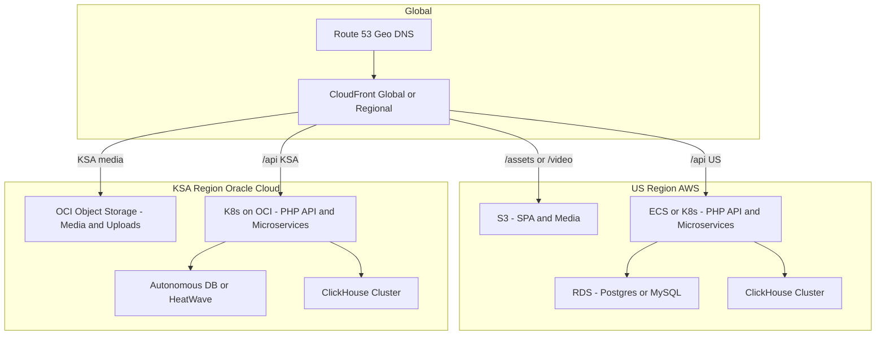

# nexaquanta

```mermaid
flowchart TB
  subgraph Global
    DNS[Route 53 Geo DNS]
    CF[CloudFront Global or Regional]
  end

  DNS --> CF

  %% AWS Region (US)
  subgraph AWS-US[US Region AWS]
    S3[S3 - SPA and Media]
    ECS_US[ECS or K8s - PHP API and Microservices]
    RDS[RDS - Postgres or MySQL]
    CH_US[ClickHouse Cluster]
  end

  %% OCI Region (KSA)
  subgraph OCI-KSA[KSA Region Oracle Cloud]
    OCI_OS[OCI Object Storage - Media and Uploads]
    K8S_KSA[K8s on OCI - PHP API and Microservices]
    ADB[Autonomous DB or HeatWave]
    CH_KSA[ClickHouse Cluster]
  end

  %% Global traffic
  CF -->|/assets or /video| S3
  CF -->|/api US| ECS_US
  CF -->|/api KSA| K8S_KSA
  CF -->|KSA media| OCI_OS

  %% Backend connections
  ECS_US --> RDS
  ECS_US --> CH_US
  K8S_KSA --> ADB
  K8S_KSA --> CH_KSA
```
